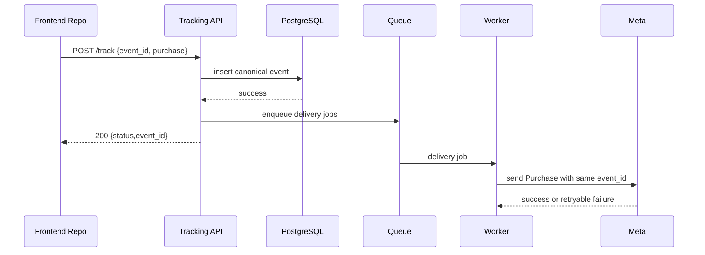
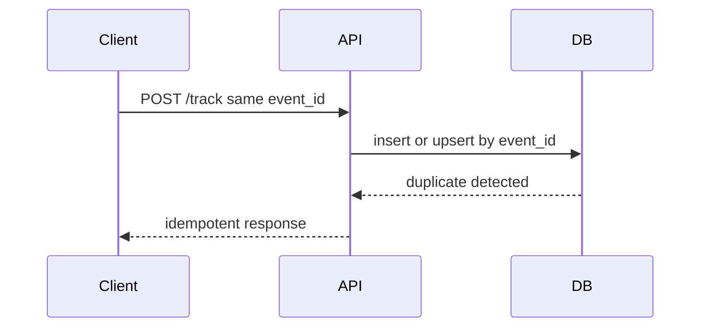

# Sequence Diagrams

## Purchase event

```mermaid
sequenceDiagram
  participant FE as Frontend Repo
  participant API as Tracking API
  participant DB as PostgreSQL
  participant Q as Queue
  participant W as Worker
  participant M as Meta

  FE->>API: POST /track {event_id, purchase}
  API->>DB: insert canonical event
  DB-->>API: success
  API->>Q: enqueue delivery jobs
  API-->>FE: 200 {status,event_id}
  Q->>W: delivery job
  W->>M: send Purchase with same event_id
  M-->>W: success or retryable failure
```

## Duplicate event

```mermaid
sequenceDiagram
  participant Client
  participant API
  participant DB

  Client->>API: POST /track same event_id
  API->>DB: insert or upsert by event_id
  DB-->>API: duplicate detected
  API-->>Client: idempotent response
```

## Related docs

- [Event flow](event-flow.md)
- [Deduplication](../03-data/deduplication.md)
